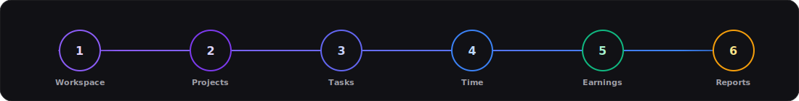
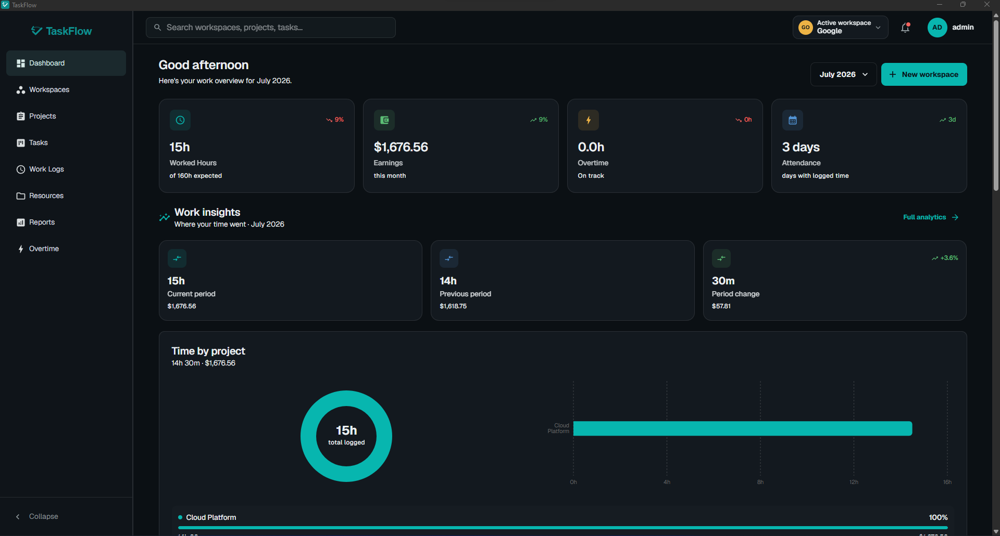
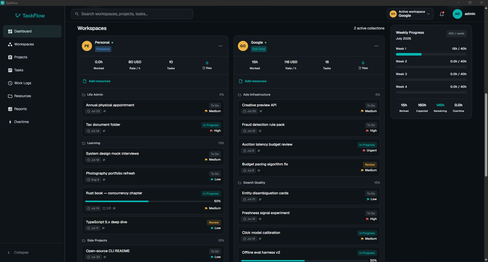
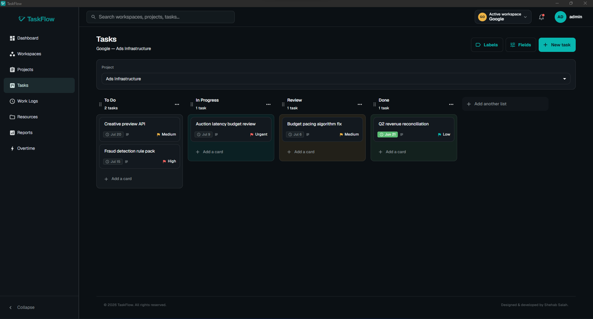
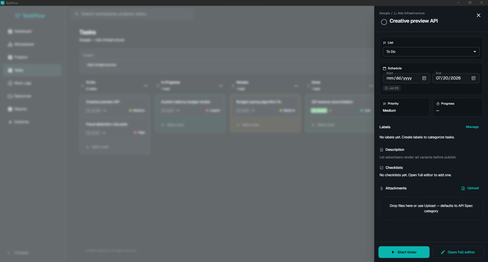
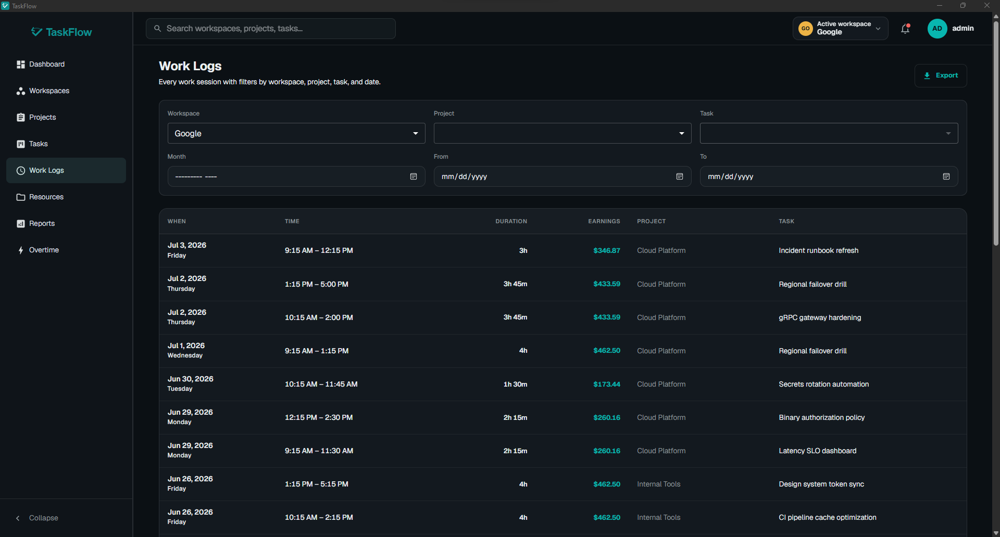
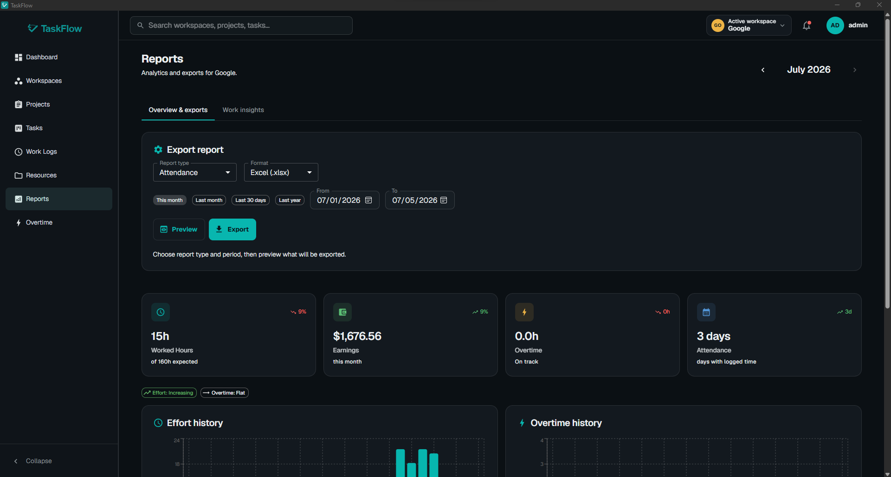
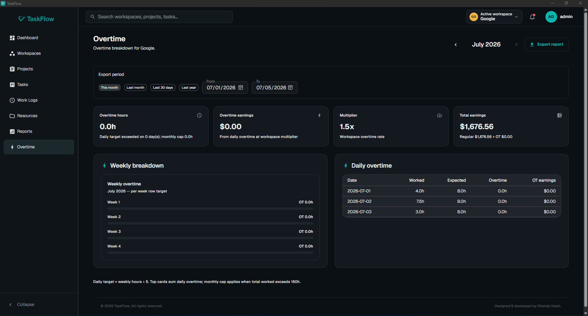
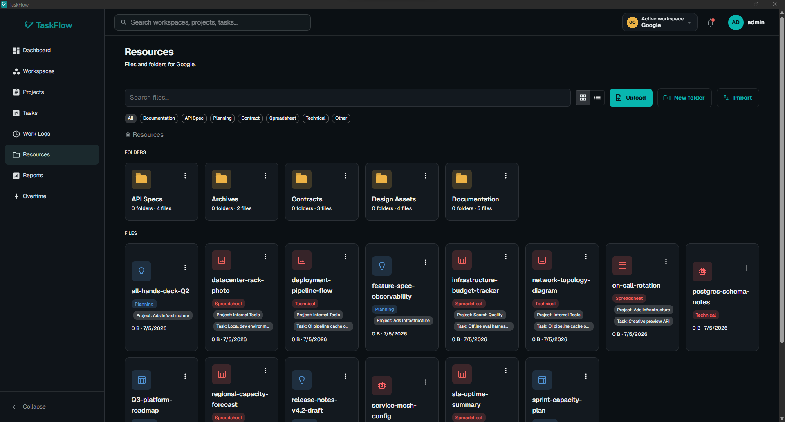

<p align="center">
  
</p>

<h1 align="center">TaskFlow — Context-aware, local-first work management</h1>

<p align="center">
  <strong>Track time. Manage work. Measure progress.</strong><br />
  TaskFlow is a desktop application for tracking time, earnings, projects, and tasks across clients, employers, and contracts. Workspaces keep each context separate; your data is stored locally on your machine.
</p>

<p align="center">
  <a href="https://shehabsalah.github.io/taskflow/">Website</a> ·
  <a href="https://shehabsalah.github.io/taskflow/docs.html">User guide</a> ·
  <a href="https://github.com/ShehabSalah/taskflow/releases">Releases</a>
</p>

<p align="center">
  <a href="https://github.com/ShehabSalah/taskflow/releases/latest"></a>
  <a href="#requirements"></a>
  <a href="#get-taskflow"></a>
  <a href="https://github.com/ShehabSalah/taskflow/releases/latest"></a>
  <a href="https://shehabsalah.github.io/taskflow/"></a>
</p>

<br/>

## Why TaskFlow exists

Most professionals stitch together **Trello + a time tracker + notes + Files** — then lose context, miss overtime, and rebuild timesheets by hand.

TaskFlow replaces that patchwork with **one context-aware desktop app**: switch workspace and everything — projects, tasks, timers, files, earnings, reports — follows that client or employer. No subscription. No cloud upload. Offline by default.

<p align="center">
  
</p>

<br/>

## See it in action

<table>
<tr>
<td width="50%" align="center">
<b>Dashboard</b><br/>
<em>Stats, earnings, and monthly progress</em><br/><br/>

</td>
<td width="50%" align="center">
<b>Dashboard workspaces</b><br/>
<em>All workspaces and active tasks at a glance</em><br/><br/>

</td>
</tr>
<tr>
<td width="50%" align="center">
<b>Tasks</b><br/>
<em>Kanban boards per project</em><br/><br/>

</td>
<td width="50%" align="center">
<b>Task detail</b><br/>
<em>Rich drawer with checklists, attachments, and timer</em><br/><br/>

</td>
</tr>
<tr>
<td width="50%" align="center">
<b>Work logs</b><br/>
<em>Filtered session history and exports</em><br/><br/>

</td>
<td width="50%" align="center">
<b>Reports</b><br/>
<em>Timesheets and attendance exports</em><br/><br/>

</td>
</tr>
<tr>
<td width="50%" align="center">
<b>Overtime</b><br/>
<em>Daily, weekly, and monthly overtime views</em><br/><br/>

</td>
<td width="50%" align="center">
<b>Resources</b><br/>
<em>Local files tied to workspaces and projects</em><br/><br/>

</td>
</tr>
</table>

<br/>

## What you get

<table>
<tr>
<td align="center" width="33%">
<h3>🎯 Context-first</h3>
<p align="left">One workspace per client, employer, or contract — salary, hours, overtime rules, and files stay isolated. Switch context in one click.</p>
</td>
<td align="center" width="33%">
<h3>🔒 Local by design</h3>
<p align="left">PostgreSQL and files on your machine. No mandatory cloud account. Work offline. App lock with auto-lock for shared computers.</p>
</td>
<td align="center" width="33%">
<h3>📊 Built to measure</h3>
<p align="left">Real-time earnings from recorded seconds. Daily, weekly, and monthly overtime. Excel/CSV timesheets from actual logs — never estimates.</p>
</td>
</tr>
</table>

| | |
|---|---|
| **Workspaces** | Full-time, part-time, freelance, project-based — each with its own salary & overtime settings |
| **Projects & tasks** | Trello-style Kanban, labels, checklists, custom-fields, attachments, comments, timers from cards |
| **Time tracking** | Start/stop at workspace, project, or task level; filtered work logs |
| **Reports** | Timesheets, attendance, overtime — export to Excel or CSV |
| **Resources** | Local files and folders tied to workspaces and projects; custom categories with your own colors |
| **Backup & restore** | Encrypted `.tfbackup` archives (database + files) from Settings — restore with your passphrase |
| **Notifications** | In-app and OS alerts for timers, overdue tasks, and reminders |
| **Updates** | Soft update check — optional banner when a newer desktop release is available |
| **Desktop** | Native Windows & macOS installers; bundled or bring-your-own PostgreSQL |

<br/>

## Latest release · v1.1.0

> **Published** — Jul 10, 2026  
> Encrypted backup & restore, in-app and OS notifications, custom resource categories, desktop soft update check, and post–v1.0.0 fixes.

<br/>

## Get TaskFlow

### Windows

| | |
|---|---|
| **File** | `TaskFlow_1.1.0_x64-setup.exe` |
| **Requires** | Windows 10 / 11 (64-bit) |
| **Download** | [**Latest release →**](https://github.com/ShehabSalah/taskflow/releases/latest) |

Run the installer. If SmartScreen warns on first run: **More info → Run anyway**.

### macOS

| Build | File | Download |
|---|---|---|
| **Apple Silicon** (M1–M4) | `TaskFlow_1.1.0_aarch64.dmg` | [**Latest release →**](https://github.com/ShehabSalah/taskflow/releases/latest) |
| **Intel** | `TaskFlow_1.1.0_x64.dmg` | [**Latest release →**](https://github.com/ShehabSalah/taskflow/releases/latest) |

Open the `.dmg`, drag **TaskFlow** to **Applications**. If Gatekeeper blocks launch: **right-click → Open**.

### First-time setup

```
Download  →  Run installer  →  Setup wizard (Easy or Advanced DB)  →  Create local account  →  Add a workspace
```

1. Download and run the installer for your platform.
2. Complete the setup wizard — **Easy mode** bundles PostgreSQL; **Advanced mode** connects your own instance.
3. Create your local account (username + password).
4. Add a workspace and start tracking.

<br/>

## Upgrading

Before a major upgrade, optionally create an encrypted backup from **Settings → Backup** (recommended).

<details>
<summary><b>Windows</b> — in-place update or clean reinstall</summary>

<br/>

**Recommended:** run the new installer over your existing install. Database, workspaces, and settings are preserved; migrations run on launch.

**If you must uninstall first:**

1. Close TaskFlow completely.
2. Uninstall via **Settings → Apps** (or **Add or remove programs**).
3. ⚠️ **When prompted about application data, leave “Remove data from disk” unchecked** (choose **Keep data**). Your workspaces, logs, and database live on your machine — checking that box deletes them permanently.
4. Install the latest release from [**Releases**](https://github.com/ShehabSalah/taskflow/releases/latest).

</details>

<details>
<summary><b>macOS</b> — replace the app, keep your data</summary>

<br/>

1. Download the latest `.dmg` from [**Releases**](https://github.com/ShehabSalah/taskflow/releases/latest).
2. Drag **TaskFlow** to **Applications**, replacing the existing app.
3. Launch — data is kept; migrations run on startup.

If Gatekeeper blocks the update:

```bash
xattr -dr com.apple.quarantine /Applications/TaskFlow.app
```

</details>

<br/>

## Requirements

| Platform | Minimum |
|---|---|
| **Windows** | Windows 10 or later (64-bit) |
| **macOS** | macOS 11 Big Sur or later — Intel & Apple Silicon |
| **Storage** | Space for app + database (Easy mode downloads PostgreSQL on first run) |

<br/>

## Questions

<details>
<summary><b>What is TaskFlow?</b></summary>
<br/>
A local-first desktop app for professionals who manage work across clients, employers, or projects — workspaces, Kanban tasks, time tracking, earnings, reports, files, overtime, encrypted backup, and notifications in one system on your machine.
</details>

<details>
<summary><b>Does it work offline?</b></summary>
<br/>
Yes. Core features run without an internet connection. Workspaces, tasks, time logs, files, and reports stay on your computer.
</details>

<details>
<summary><b>Is my data uploaded to the cloud?</b></summary>
<br/>
No. There is no required cloud account and no default data upload. Files, logs, and earnings remain local unless you export them.
</details>

<details>
<summary><b>Can I manage multiple clients or employers?</b></summary>
<br/>
Yes. Create one workspace per client, employer, or contract. Switching workspaces shows only that context's projects, tasks, timers, and reports.
</details>

<details>
<summary><b>Do I need to install PostgreSQL myself?</b></summary>
<br/>
Not necessarily. The setup wizard offers <strong>Easy mode</strong> (bundled PostgreSQL) or <strong>Advanced mode</strong> (connect your own instance).
</details>

<details>
<summary><b>Is there a subscription?</b></summary>
<br/>
No. Install once, run locally. No recurring fee for core features.
</details>

<br/>

## Support

Found a bug or have feedback?

[](https://www.linkedin.com/in/shehabsalah/)
[](https://github.com/ShehabSalah/taskflow/issues)

Include your **OS**, **TaskFlow version**, and **steps to reproduce**.

<br/>

---

<p align="center">
  <br/>
  <strong>TaskFlow</strong> · built by <a href="https://github.com/ShehabSalah">Shehab Salah</a><br/>
  <sub>Free to download and use · Proprietary software · © 2026 Shehab Salah · All rights reserved</sub>
</p>

<p align="center">
  <a href="https://shehabsalah.github.io/taskflow/">Website</a> ·
  <a href="https://shehabsalah.github.io/taskflow/docs.html">User guide</a> ·
  <a href="https://github.com/ShehabSalah/taskflow/releases">Releases</a>
</p>
